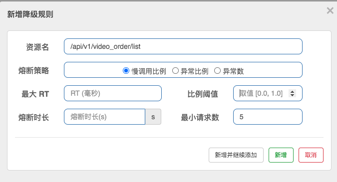

### 引言

#### 微服务架构常见核心组件

- 网关
  - 路由+过滤器
- 服务注册发现
  - 调用和被调用方的信息维护
- 配置中心
  - 管理配置，动态更新 application.properties
- 链路追踪
  - 分析调用链路耗时，保存数据库
- 负载均衡器
  - 分发流量到多个节点，降低压力
- 熔断
  - 保护自己和被调用方

#### 微服务架构常见解决方案

- ServiceComb
  - 华为内部的CSE(Cloud Service Engine)框架开源, 一个微服务的开源解决方案,社区相对于下面几个比较小
  - 文档不多，通信领域比较强
- dubbo
  - zookeeper + dubbo + springmvc/springboot
  - 官方地址：http://dubbo.apache.org/#!/?lang=zh-cn
  - 配套
    - 通信方式：rpc
    - 注册中心：zookeper/redis/nacos
    - 配置中心：diamond、nacos
- SpringCloud
  - 全家桶+轻松嵌入第三方组件(Netflix 奈飞)
  - 官网：https://spring.io/projects/spring-cloud
  - 配套
    - 通信方式：http restful
    - 注册中心：eruka
    - 配置中心：config
    - 断路器：hystrix
    - 网关：zuul/gateway
    - 分布式追踪系统：sleuth+zipkin
- Spring Alibaba Cloud
  - 全家桶+阿里生态多个组件组合+SpringCloud支持
  - 官网 https://spring.io/projects/spring-cloud-alibaba
  - 配套
    - 通信方式：http restful
    - 注册中心：nacos
    - 配置中心：nacos
    - 断路器：sentinel
    - 网关：gateway
    - 分布式追踪系统：sleuth+zipkin

#### 微服务核心组件图


### 起步

- 创建聚合工程

  ```
  modelVersion>4.0.0</modelVersion>
      <groupId>net.company</groupId>
      <artifactId>cloud-dmeo</artifactId>
      <version>1.0-SNAPSHOT</version>
      <modules>
          <module>module-common</module>
          <module>module1</module>
          <module>module2</module>
          <module>module3r</module>
      </modules>
  
      <!-- 一般来说父级项目的packaging都为pom，packaging默认类型jar类型-->
      <packaging>pom</packaging>
  
      <properties>
          <java.version>1.8</java.version>
          <maven.compiler.source>1.8</maven.compiler.source>
          <maven.compiler.target>1.8</maven.compiler.target>
       </properties>
  ```

- 创建子项目

  ```
   <dependencies>
          <dependency>
              <groupId>org.springframework.boot</groupId>
              <artifactId>spring-boot-starter-web</artifactId>
          </dependency>
  
          <dependency>
              <groupId>net.company</groupId>
              <artifactId>module-common</artifactId>
              <version>1.0-SNAPSHOT</version>
          </dependency>
      </dependencies>
  ```

- 配置数据库连接（注意 端口、应用名称、数据库名称）

  ```
  server:
    port: 9000
  
  spring:
    application:
      name: module1
    datasource:
      driver-class-name: com.mysql.cj.jdbc.Driver
      url: jdbc:mysql://127.0.0.1:3306/cloud_video?useUnicode=true&characterEncoding=utf-8&useSSL=false
      username: root
      password: 123456
  
  # 控制台输出sql、下划线转驼峰
  mybatis:
    configuration:
      log-impl: org.apache.ibatis.logging.stdout.StdOutImpl
      map-underscore-to-camel-case: true
  ```

### 起飞

#### Think  about it

- 服务间的调用

  ```
  RPC:
    远程过程调用，像调用本地服务(方法)一样调用服务器的服务
    支持同步、异步调用
    客户端和服务器之间建立TCP连接，可以一次建立一个，也可以多个调用复用一次链接
    RPC数据包小
      protobuf
      thrift
    rpc：编解码，序列化，链接，丢包，协议
    
  Rest(Http):
    http请求，支持多种协议和功能
    开发方便成本低
    http数据包大
    java开发：resttemplate或者httpclient
  ```

- 用户间的调用

  ```
  @Bean
  public RestTemplate getRestTemplate(){
      return new RestTemplate();
  }
      
  Video video = restTemplate.getForObject("http://localhost:9000/api/v1/video/find_by_id?videoId="+videoId,Video.class);
  ```

- 存在的问题
  - 服务之间的IP信息写死
  - 服务之间无法提供负载均衡
  - 多个服务直接关系调用维护复杂

#### nacos注册中心

##### 注册中心和常见的注册中心

- 注册中心（服务治理）

  - 服务注册：服务提供者provider，启动的时候向注册中心上报自己的网络信息
    - 服务发现：服务消费者consumer,启动的时候向注册中心上报自己的网络信息，拉取provider的相关网络信息
  - 核心:服务管理,是有个服务注册表，心跳机制动态维护，服务实例在启动时注册到服务注册表，并在关闭时注销。

- 有什么用

  - 微服务应用和机器越来越多，调用方需要知道接口的网络地址，如果靠配置文件的方式去控制网络地址，对于动态新增机器，维护带来很大问题

- 主流的注册中心：zookeeper、Eureka、consul、etcd、Nacos

  |                 | **Nacos**                  | **Eureka** | **Consul**        | **Zookeeper** |
  | :-------------- | :------------------------- | :--------- | :---------------- | :------------ |
  | 一致性协议      | CP+AP                      | AP         | CP                | CP            |
  | 健康检查        | TCP/HTTP/MYSQL/Client Beat | 心跳       | TCP/HTTP/gRPC/Cmd | Keep Alive    |
  | 雪崩保护        | 有                         | 有         | 无                | 无            |
  | 访问协议        | HTTP/DNS                   | HTTP       | HTTP/DNS          | TCP           |
  | SpringCloud集成 | 支持                       | 支持       | 支持              | 支持          |

  - Zookeeper：CP设计，保证了一致性，集群搭建的时候，某个节点失效，则会进行选举行的leader，或者半数以上节点不可用，则无法提供服务，因此可用性没法满足
  - Eureka：AP原则，无主从节点，一个节点挂了，自动切换其他节点可以使用，去中心化

   

  - 结论：
    - 分布式系统中P,肯定要满足，所以只能在CA中二选一
    - 没有最好的选择，最好的选择是根据业务场景来进行架构设计
    - 如果要求一致性，则选择zookeeper/Nacos，如金融行业 CP
    - 如果要求可用性，则Eureka/Nacos，如电商系统 AP
    - CP ： 适合支付、交易类，要求数据强一致性，宁可业务不可用，也不能出现脏数据
    - AP: 互联网业务，比如信息流架构，不要求数据强一致，更想要服务可用


##### CAP理论

- CAP定理: 指的是在一个分布式系统中，Consistency（一致性）、 Availability（可用性）、Partition tolerance（分区容错性），三者不可同时获得

  - 一致性（C）：所有节点都可以访问到最新的数据
  - 可用性（A）：每个请求都是可以得到响应的，不管请求是成功还是失败
  - 分区容错性（P）：除了全部整体网络故障，其他故障都不能导致整个系统不可用

   

- CAP理论就是说在分布式存储系统中，最多只能实现上面的两点。而由于当前的网络硬件肯定会出现延迟丢包等问题，所以分区容忍性是我们必须需要实现的。所以我们只能在一致性和可用性之间进行权衡

  

```
CA： 如果不要求P（不允许分区），则C（强一致性）和A（可用性）是可以保证的。但放弃P的同时也就意味着放弃了系统的扩展性，也就是分布式节点受限，没办法部署子节点，这是违背分布式系统设计的初衷的

CP: 如果不要求A（可用），每个请求都需要在服务器之间保持强一致，而P（分区）会导致同步时间无限延长(也就是等待数据同步完才能正常访问服务)，一旦发生网络故障或者消息丢失等情况，就要牺牲用户的体验，等待所有数据全部一致了之后再让用户访问系统

AP：要高可用并允许分区，则需放弃一致性。一旦分区发生，节点之间可能会失去联系，为了高可用，每个节点只能用本地数据提供服务，而这样会导致全局数据的不一致性。
```

##### CAP的权衡结果 BASE理论

- 什么是Base理论

```
CAP 中的一致性和可用性进行一个权衡的结果，核心思想就是：我们无法做到强一致，但每个应用都可以根据自身的业务特点，采用适当的方式来使系统达到最终一致性, 来自 ebay 的架构师提出
```

- Basically Available(基本可用)
  - 假设系统，出现了不可预知的故障，但还是能用, 可能会有性能或者功能上的影响
- Soft state（软状态）
  - 允许系统中的数据存在中间状态，并认为该状态不影响系统的整体可用性，即允许系统在多个不同节点的数据副本存在数据延时 
- Eventually consistent（最终一致性）
  - 系统能够保证在没有其他新的更新操作的情况下，数据最终一定能够达到一致的状态，因此所有客户端对系统的数据访问最终都能够获取到最新的值

##### Nacos搭建

- 下载安装

  官网：https://nacos.io/zh-cn/

- 进入bin目录

- 启动 sh startup.sh -m standalone

- 访问 localhost:8848/nacos

- 默认账号密码 nacos/nacos

##### 项目集成Nacos

- 添加依赖

  ```
  <dependency>
       <groupId>com.alibaba.cloud</groupId>
       <artifactId>spring-cloud-starter-alibaba-nacos-discovery</artifactId>
  </dependency>
  // 所有子模块都需要添加
  ```

- 配置Nacos地址

  ```
  server:
    port: 9000
  
  spring:
    application:
      name: servicename
    cloud:
      nacos:
        discovery:
          server-addr: 127.0.0.1:8848
  ```

- 启动类增加注解

  ```
  @EnableDiscoveryClient
  ```

- 服务之间的调用

  ```
    @Autowired
      private DiscoveryClient discoveryClient;
  
    @Autowired
      private RestTemplate restTemplate;
      
     @RequestMapping("save")
      public VideoOrder save(int videoId){
  
          VideoOrder videoOrder = new VideoOrder();
          videoOrder.setVideoId(videoId);
  
          List<ServiceInstance> list = discoveryClient.getInstances("xdclass-video-service");
  
          ServiceInstance serviceInstance = list.get(0);
  		//订单调视频
          Video video = restTemplate.getForObject("http://"+serviceInstance.getHost()+":"+serviceInstance.getPort()+
                  "/api/v1/video/find_by_id?videoId="+videoId,Video.class);
  
          videoOrder.setVideoTitle(video.getTitle());
          videoOrder.setVideoId(video.getId());
          return videoOrder;
  
      }
  ```

#### Ribbon+Feign实现负载均衡

##### 负载均衡和常见的解决方案

- 什么是负载均衡（Load Balance）
  - 分布式系统中一个非常重要的概念，当访问的服务具有多个实例时，需要根据某种“均衡”的策略决定请求发往哪个节点，这就是所谓的负载均衡，原理是将数据流量分摊到多个服务器执行，减轻每台服务器的压力，从而提高了数据的吞吐量。

- 负载均衡的种类
  - 软硬件角度
    - 通过硬件来进行解决，常见的硬件有NetScaler、F5、Radware和Array等商用的负载均衡器，但比较昂贵的
    - 通过软件来进行解决，常见的软件有LVS、Nginx等,它们是基于Linux系统并且开源的负载均衡策略
  - 端的角度
    - 服务端负载均衡
    - 客户端负载均衡


- 常见的负载均衡策略（看组件的支持情况）
  - 节点轮询
    - 简介：每个请求按顺序分配到不同的后端服务器
  - weight 权重配置
    - 简介：weight和访问比率成正比，数字越大，分配得到的流量越高
  - 固定分发
    - 简介：根据请求按访问ip的hash结果分配，这样每个用户就可以固定访问一个后端服务器
  - 随机选择、最短响应时间等等

##### AlibabaCloud集成Ribbon实现负载均衡

- 订单服务增加@LoadBalanced 注解

```
@Bean
@LoadBalanced
public RestTemplate restTemplate() {
  return new RestTemplate();
}
```

- 调用实战

```
Video video = restTemplate.getForObject("http://xdclass-video-service/api/v1/video/find_by_id?videoId="+videoId, Video.class);

注意：方便大家看到负载均衡效果，在video类增加这个字段，记录当前机器ip+端口
```

- 源码解析

  @LoadBalanced 1）首先从注册中心获取provider的列表 2）通过一定的策略选择其中一个节点 3）再返回给restTemplate调用

  其实采用的是轮询策略

- 自定义Ribbon负载均衡策略

  - Ribbon支持的负载均衡策略

  | RandomRule                | 随机策略           | 随机选择server                                               |
  | ------------------------- | ------------------ | :----------------------------------------------------------- |
  | RoundRobinRule            | 轮询策略           | 按照顺序选择server（默认）                                   |
  | RetryRule                 | 重试策略           | 当选择server不成功，短期内尝试选择一个可用的server           |
  |                           |                    |                                                              |
  | AvailabilityFilteringRule | 可用过滤策略       | 过滤掉一直失败并被标记为circuit tripped的server，过滤掉那些高并发链接的server（active connections超过配置的阈值） |
  | WeightedResponseTimeRule  | 响应时间加权重策略 | 根据server的响应时间分配权重，以响应时间作为权重，响应时间越短的服务器被选中的概率越大，综合了各种因素，比如：网络，磁盘，io等，都直接影响响应时间 |
  | ZoneAvoidanceRule         | 区域权重策略       | 综合判断server所在区域的性能，和server的可用性，轮询选择server |

  - 负载均衡策略调整实战

```
订单服务增加配置

xdclass-video-service:
  ribbon:
    NFLoadBalancerRuleClassName: com.netflix.loadbalancer.RandomRule
 //策略选择： 1、如果每个机器配置一样，则建议不修改策略 (推荐) 2、如果部分机器配置强，则可以改为 WeightedResponseTimeRule
```

Open-Feign

##### Feign

- 什么是Feign:

  ```
  SpringCloud提供的伪http客户端(本质还是用http)，封装了Http调用流程，更适合面向接口化
  让用Java接口注解的方式调用Http请求.
  
  不用像Ribbon中通过封装HTTP请求报文的方式调用 Feign默认集成了Ribbon
  Nacos支持Feign,可以直接集成实现负载均衡的效果
  ```

##### 集成Feign

- 加入依赖

  ```
  <dependency>
              <groupId>org.springframework.cloud</groupId>
              <artifactId>spring-cloud-starter-openfeign</artifactId>
  </dependency>
  ```

- 配置注解

  ```
  启动类增加@EnableFeignClients
  ```

- 增加一个接口

  ```
  订单服务增加接口，服务名称记得和nacos保持一样
  @FeignClient(name="xdclass-video-service") 
  ```

#### 流控防卫兵Sentinel

##### 高并发下的微服务容错方案

- 限流

- 漏斗，不管流量多大，均匀的流入容器，令牌桶算法，漏桶算法

  

- 熔断：

  - 保险丝，熔断服务，为了防止整个系统故障，包含当前和下游服务 下单服务 -》商品服务-》用户服务 -》（出现异常-》熔断风控服务

- 降级：

  - 抛弃一些非核心的接口和数据，返回兜底数据 旅行箱的例子：只带核心的物品，抛弃非核心的，等有条件的时候再去携带这些物品

- 隔离：
  - 服务和资源互相隔离，比如网络资源，机器资源，线程资源等，不会因为某个服务的资源不足而抢占其他服务的资源

- 熔断和降级互相交集
  - 相同点：
    - 从可用性和可靠性触发，为了防止系统崩溃
    - 最终让用户体验到的是某些功能暂时不能用
  - 不同点
    - 服务熔断一般是下游服务故障导致的，而服务降级一般是从整体系统负荷考虑，由调用方控制

- 官网：https://github.com/alibaba/Sentinel/wiki/%E4%BB%8B%E7%BB%8D

##### Sentinel控制台搭建

- 引入Sentinel依赖

  ```
  <dependency>
              <groupId>com.alibaba.cloud</groupId>
              <artifactId>spring-cloud-starter-alibaba-sentinel</artifactId>
  </dependency>
  ```

  注意：Sentinel 控制台目前仅支持单机部

- 启动

  ```
  //启动 Sentinel 控制台需要 JDK 版本为 1.8 及以上版本，
  //-Dserver.port=8080 用于指定 Sentinel 控制台端口为 8080 
  //默认用户名和密码都是 sentinel
  
  java -Dserver.port=8080 -Dcsp.sentinel.dashboard.server=localhost:8080 -Dproject.name=sentinel-dashboard -jar sentinel-dashboard-1.8.0.jar
  ```

##### 项目整合Sentinel

- 接入sentinel

  ```
  spring:
    cloud:
      sentinel:
        transport:
          dashboard: 127.0.0.1:8080 
          port: 9999 
  
  #dashboard: 8080 控制台端口
  #port: 9999 本地启的端口，随机选个不能被占用的，与dashboard进行数据交互，会在应用对应的机器上启动一个 Http Server，该 Server 会与 Sentinel 控制台做交互, 若被占用,则开始+1一次扫描
  ```

  微服务注册上去后，由于Sentinel是懒加载模式，所以需要访问微服务后才会在控制台出现

##### 流量控制的效果

- 直接拒绝：默认的流量控制方式，当QPS超过任意规则的阈值后，新的请求就会被立即拒绝

   

- Warm Up：冷启动/预热，如果系统在此之前长期处于空闲的状态，我们希望处理请求的数量是缓步的增多，经过预期的时间以后，到达系统处理请求个数的最大值


- 匀速排队：严格控制请求通过的间隔时间，也即是让请求以均匀的速度通过，对应的是漏桶算法，主要用于处理间隔性突发的流量，如消息队列，想象一下这样的场景，在某一秒有大量的请求到来，而接下来的几秒则处于空闲状态，我们希望系统能够在接下来的空闲期间逐渐处理这些请求，而不是在第一秒直接拒绝多余的请求

  

  - 注意：
    - 匀速排队等待策略是 Leaky Bucket 算法结合虚拟队列等待机制实现的。
    - 匀速排队模式暂时不支持 QPS > 1000 的场景

##### Sentinel熔断降级规则

- 熔断降级（虽然是两个概念，基本都是互相配合）

  - 对调用链路中不稳定的资源进行熔断降级也是保障高可用的重要措施之一
  - 对不稳定的**弱依赖服务调用**进行熔断降级，暂时切断不稳定调用，避免局部不稳定因素导致整体的雪崩
  - 熔断降级作为保护自身的手段，通常在客户端（调用端）进行配置

- Sentinel 熔断策略

  - 慢调用比例(响应时间): 选择以慢调用比例作为阈值，需要设置允许的慢调用 RT（即最大的响应时间），请求的响应时间大于该值则统计为慢调用

    - 比例阈值：修改后不生效-目前已经反馈给官方那边的bug
    - 熔断时长：超过时间后会尝试恢复
    - 最小请求数：熔断触发的最小请求数，请求数小于该值时即使异常比率超出阈值也不会熔断

    

  - 异常比例：当单位统计时长内请求数目大于设置的最小请求数目，并且异常的比例大于阈值，则接下来的熔断时长内请求会自动被熔断

    - 比例阈值
    - 熔断时长：超过时间后会尝试恢复
    - 最小请求数：熔断触发的最小请求数，请求数小于该值时，即使异常比率超出阈值也不会熔断

    

  - 异常数：当单位统计时长内的异常数目超过阈值之后会自动进行熔断

    - 异常数:
    - 熔断时长：超过时间后会尝试恢复
    - 最小请求数：熔断触发的最小请求数，请求数小于该值时即使异常比率超出阈值也不会熔断

    

#####  Sentinel的熔断状态和恢复

- 服务熔断一般有三种状态

  - 熔断关闭（Closed）

    - 服务没有故障时，熔断器所处的状态，对调用方的调用不做任何限制

  - 熔断开启（Open）

    - 后续对该服务接口的调用不再经过网络，直接执行本地的fallback方法

  - 半熔断（Half-Open）

    - 所谓半熔断就是尝试恢复服务调用，允许有限的流量调用该服务，并监控调用成功率

    

- 熔断恢复：

  - 经过熔断时长后熔断器会进入探测恢复状态（HALF-OPEN 状态）尝试恢复服务调用，允许有限的流量调用该服务，并监控调用成功率。
  - 如果成功率达到预期，则说明服务已恢复，进入熔断关闭状态；如果成功率仍旧很低，则重新进入熔断状态

##### Sentinel自定义异常-整合Open-Feign