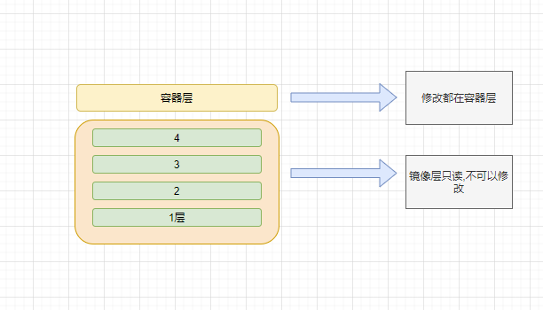

#### 简介

- 什么是Dokcer？

  ```
  百科:一个开源的应用容器引擎，让开发者可以打包他们的应用以及依赖包到一个可移植的容器中，然后发布到任
  何流行的 Linux 机器上，也可以实现虚拟化。容器是完全使用沙箱机制，相互之间不会有任何接口；
  使用go语言编写，在LCX（linux容器）基础上进行的封装
  简单来说分三点：
  1）就是可以快速部署启动应用
  2）实现虚拟化，完整资源隔离
  3）一次编写，四处运行（有一定的限制，比如Docker是基于Linux 64bit的，无法在32bit的
  linux/Windows/unix环境下使用）
  ```

- 为什么要用？

  ```
  1、提供一次性的环境，假如需要安装Mysql，则需要安装很多依赖库、版本等，如果使用Docker则通过镜像就
  可以直接启动运行
  2、快速动态扩容，使用docker部署了一个应用，可以制作成镜像，然后通过Dokcer快速启动
  3、组建微服务架构，可以在一个机器上模拟出多个微服务，启动多个应用
  4、更好的资源隔离和共享
  ```

#### 安装

- Windows:

  ​	懂的都懂

- Linux:

  - centOS版本建议3.8以上(uname -a 查看内核版本)

  - systemctl stop firewalld.service 关闭防火墙避免踩坑

  - vi /etc/selinux/config 关闭selinux

  - 安装阿里docker社区版yum源

    ```
    [root@zyaire ~]# cd /etc/yum.repos.d/
    [root@zyaire yum.repos.d]#
    [root@zyaire yum.repos.d]# wget http://mirrors.aliyun.com/dockerce/linux/centos/docker-ce.repo
    ```

  - 查看docker安装包：yum list | grep docker

  - 安装Docker Ce 社区版本：yum install -y docker-ce.x86_64 

  - 设置开机启动：systemctl enable docker 

  - 更新xfsprogs：yum -y update xfsprogs 

  - 启动docker：systemctl start docker 

  - 查看版本：docker version 

  - 查看详细信息：docker info

  DuangDuangDuang, 还有个更简便的安装方法,看:

  ```
  https://help.aliyun.com/document_detail/51853.html?spm=a2c4g.11186623.6.820.RaToNY
  ```

  

#### 入门命令

##### 查看和删除

- 查看本地镜像： docker images 

- 搜索镜像：docker search centos 
- 搜索镜像并过滤是官方的： docker search --filter "is-official=true" centos 
- 搜索镜像并过滤大于多少颗星星的：docker search --filter stars=10 centos 
- 下载centos7镜像：docker pull centos:7 
- 修改本地镜像名字（小写）：docker tag centos:7 mycentos:1
- 本地镜像的删除：docker rmi centos:7

##### 配置阿里云镜像

- 配置步骤参考阿里文档:[https://cr.console.aliyun.com/cnbeijing/instances/mirrors](https://cr.console.aliyun.com/cnbeijing/instances/mirrors)

##### 创建查看重启停止

- 构建容器：docker run -itd --name=mycentos centos:7 
  - -i ：表示以交互模式运行容器（让容器的标准输入保持打开）
  - -d：表示后台运行容器，并返回容器ID 
  - -t：为容器重新分配一个伪输入终端 { "registry-mirrors": ["https://5xok66d4.mirror.aliyuncs.com"] } 
  - --name：为容器指定名称 查看本地所有的容器：docker ps -a 查看本地正在运行的容器：docker ps 
- 停止容器：docker stop CONTAINER_ID / CONTAINER_NAME 
- 一次性停止所有容器：docker stop $(docker ps -a -q) 
- 启动容器：docker start CONTAINER_ID / CONTAINER_NAME 
- 重启容器：docker restart CONTAINER_ID / CONTAINER_NAME
-  删除容器：docker rm CONTAINER_ID / CONTAINER_NAME 
- 强制删除容器：docker rmi -f CONTAINER_ID / CONTAINER_NAME 
- 查看容器详细信息：docker inspect CONTAINER_ID / CONTAINER_NAME 
- 进入容器：docker exec -it CONTAINER_ID / CONTAINER_NAME /bin/bash

##### 容器和宿主机之间文件复制与挂载

- 从宿主机复制到容器：docker cp 宿主机本地路径 容器名字/ID：容器路径          docker cp /root/123.txt mycentos:/home/
-  从容器复制到宿主机：docker cp 容器名字/ID：容器路径 宿主机本地路径 docker cp mycentos:/home/456.txt /root 
- 宿主机文件夹挂载到容器里：docker run -itd -v 宿主机路径:容器路径 镜像ID docker run -itd -v /root/mytest/:/home centos:7  (容器和宿主机之间的数据同步更新, 想想数据库吧...)

#### 实战

##### 构建自定义镜像

- commit方法
  - 构建镜像： docker commit   CONTAINER_ID / CONTAINER_NAME  \<镜像名称>:\<版本号> 
    - a：标注作者 
    - -m：说明注释

  eg: `docker commit -a "XD" -m"mkdir/home/mytest" 4eb9d14ebb18 mycentos:v1`

- dockefile方法

  - 构建:docker build -t \<name>:\<tag>.   (.表示当前路径)

  - 镜像分层结构

    

  - dockerfile常用指令

    - FROM 基于哪个镜像 
    - MAINTAINER 注明作者
    -  COPY 复制文件进入镜像（只能用相对路径，不能用绝对路径） 
    - ADD 复制文件进入镜像（假如文件是.tar.gz文件会解压） 
    - WORKDIR： 指定工作目录，假如路径不存在会创建路径 
    - ENV 设置环境变量 EXPOSE 暴露容器端口 
    - RUN在构建镜像的时候执行，作用于镜像层面 
    - ENTRYPOINT 在容器启动的时候执行，作用于容器层，dockerfile里有多条时只允许执行最后一条(优先于cmd执行)
    - CMD 在容器启动的时候执行，作用于容器层，dockerfile里有多条时只允许执行最后一条 容器启动后执行默认的命令或者参数，允许被修改 (允许传参,没太搞懂....../bin/bash???)
    - 命令格式： 
      1. shell命令格式：RUN yum install -y net-tools
      2. exec命令格式：RUN [ "yum","install" ,"-y" ,"net-tools"]

  - dockerfile

    ```
    #第一个
    FROM centos:7
    RUN echo "images building!"
    CMD ["echo","container","starting..."]
    ENTRYPOINT ["echo","container","starting ！！！"]
    #第二个
    FROM centos:7
    RUN echo "images building!"
    CMD ["echo","containe1r","starting..."]
    CMD ["echo","container2","starting..."]
    ENTRYPOINT ["echo","container2","starting ！！！"]
    ENTRYPOINT ["echo","container2","starting ！！！"]
    #第三个
    FROM centos:7
    CMD ["-ef"]
    ENTRYPOINT ["ps"]
    	#假如执行docker run xxx:xx aux   ps -ef 会变成 ps aux!!!!
    
    ```

##### Docker构建JAVA网站镜像

- 宿主机配置java环境:  有手就行,快上车不解释
- 安装tomcat
- 构建镜像:docker build -t mycentos:jdk

- dockerfile 

  ```
  FROM centos:7
  ADD jdk-8u211-linux-x64.tar.gz /usr/local
  RUN mv /usr/local/jdk1.8.0_211 /usr/local/jdk
  ENV JAVA_HOME=/usr/local/jdk
  ENV JRE_HOME=$JAVA_HOME/jre
  ENV CLASSPATH=$JAVA_HOME/lib:$JRE_HOME/lib:$CLASSPATH
  ENV PATH=$JAVA_HOME/bin:$JRE_HOME/bin:$PATH
  ADD apache-tomcat-8.5.35.tar.gz /usr/local
  RUN mv /usr/local/apache-tomcat-8.5.35 /usr/local/tomcat
  EXPOSE 8080
  ENTRYPOINT ["/usr/local/tomcat/bin/catalina.sh","run"]
  ```

- 启动容器：

  ```
  docker run -itd -p 80:8080 -v /root/test/ROOT:/usr/local/tomcat/webapps/ROOT
  mycentos:jdk /bin/bash
  ```

- 踩坑:

  出现iptables错误的时候打开防火墙, 以及tomcat要以前台方式启动(./catalina.sh)

##### Docker构建nginx镜像

- dockerfile

  ```
  FROM centos:7
  ADD nginx-1.16.0.tar.gz /usr/local
  COPY nginx_install.sh /usr/local
  RUN sh /usr/local/nginx_install.sh
  EXPOSE 80
  ```

- 安装nginx脚本

  ```
  #!/bin/bash
  yum install -y gcc gcc-c++ make pcre pcre-devel zlib zlib-devel
  #安装nginx依赖
  cd /usr/local/nginx-1.16.0
  ./configure --prefix=/usr/local/nginx && make && make install
  ```

- 制作nginx镜像

  ```
  docker build -t mycentos:nginx
  ```

- 启动nginx

  - 在容器里nginx是以daemon方式启动，退出容器时，nginx程序也会随着停止：/usr/local/nginx/sbin/nginx
  - 使用前台方式永久运行：/usr/local/nginx/sbin/nginx -g "daemon off;"

- 检查验证:

  ```
  docker run -itd -p 80:80 mycentos:nginx /usr/local/nginx/sbin/nginx -g "daemon off;"
  ```

##### Docker构建redis镜像

- dockerfile

  ```
  #!/bin/bash
  yum install -y gcc gcc-c++ make openssl openssl-devel
  cd /home/redis-4.0.9
  make && make PREFIX=/usr/local/redis install
  mkdir -p /usr/local/redis/conf/
  cp /home/redis-4.0.9/redis.conf /usr/local/redis/conf/
  #sed -i '69s/127.0.0.1/0.0.0.0/' /usr/local/redis/conf/redis.conf
  #sed -i '88s/protected-mode yes/protected-mode no/' /usr/local/redis/conf/redis.conf
  #sed -i 表示修改源文件,不安全所以不建议
  ```

- 安装redis脚本

  ```
  FROM centos:7
  ADD redis-4.0.9.tar.gz /home
  COPY redis_install.sh /home
  RUN sh /home/redis_install.sh
  ENTRYPOINT /usr/local/redis/bin/redis-server /usr/local/redis/conf/redis.conf
  ```

- 测试redis

  - 启动容器：docker run -itd -p 6380:6379 mycentos:redis #6380是宿主机端口，6379是容器的端口 
  - 进入容器：docker exec -it 9b402baeaba7 /bin/bash 
  - 宿主机连接redis： /usr/local/redis/bin/redis-cli -p 6380 
  - 验证：

  ```
  [root@zyaire home]# /usr/local/redis/bin/redis-cli -p 6380
  127.0.0.1:6380> set name mytest
  OK
  127.0.0.1:6380> get name
  "mytest"
  127.0.0.1:6380>
  
  ```

  

##### Docker构建mysql镜像

- 启动命令

  ```
  docker run --name some-mysql -p 3307:3306 -e MYSQL_ROOT_PASSWORD=abc123456 -d mysql:5.7
  #-e MYSQL_ROOT_PASSWORD=abc123456  指定root用户密码
  ```

- 进入容器

  ```
  docker exec -it 4336ae28fbfa env LANG=C.UTF-8 /bin/bash
  #env LANG=C.UTF-8 设置中文,否则中文字符不会显示(小坑!!!因为pull下来的mysql:5.7 默认镜像FROM Debian)
  ```

- dockerfile

  ```
  FROM mysql:5.7
  WORKDIR /docker-entrypoint-initdb.d
  ENV LANG=C.UTF-8
  ADD init.sql .
  #ADD会执行这个sql,而copy不会,因此不能替换成COPY。并且因为指定了WORKDIR,所以ADD的路径为<.>
  ```

#### docker网络模式

- 模式介绍：

  - bridge：桥接模式 

  - host：主机模式 

  - none：无网络模式

    查看网络模式：docker network ls

- bridge模式

  - 容器有自己的ip，外部无法直接访问
  - route  -n：查看路由表（可能需要安装 yum install  -y  net-tools）
  - brctl show：查看桥接关系（安装yum install -y bridge-utils）

- host模式

  - 容器没有自己的ip（使用宿主机的ip，因此网络比桥接模式好，但是会占用宿主机端口，网络隔离性差一点）

  - docker启动命令加上

    ```
     --net=host
    ```

    表示以host模式启动

- none模式:

  ​	用于测试和个人学习，同样在启动命令加上--net=none表示以none模式启动，docker inspect CONTAINER_ID/CONTAINER_NAME 是看不到容器ip的。

##### docker容器间基于link实现单向通讯

​	可以用于多台tomcat和数据库通讯。(因为mysql挂掉之后重启，docker会重新分配ip，docker启动mysql容器时可以--name=mydb指定名称，tomcat容器直接ping mydb就行，就不用在乎ip）

- 启动mysql数据库容器

  ```
  docker run --name mydb -e MYSQL_ROOT_PASSWORD=abc123456 -d mysql:5.7
  ```

- 启动tomcat应用容器并link到mysql数据库：

  ```
  docker run -itd --name tomcat1 --link mydb tomcat:<tag>
  ```

- mysql容器里是ping不通tomcat容器的

  mysql容器里需要安装ping命令---------前面已经说过mysql容器构建镜像不是centOS

  ```
  apt-get update && apt-get install iputils-ping
  ```

##### docker容器间利用bridge实现双向通讯

- 创建一个新的网桥：

  ```
  docker network create -d bridge BRIDGE_NAME
  ```

- 启动第一个容器：

  ```
  docker run -itd --name tomcat centos:7 
  ```

- 启动第二个容器：

  ```
  docker run -itd --name redis centos:7 
  ```

- 把第一个容器加入网桥：

  ```
  docker network connect my_bridge tomcat 
  ```

- 把第二个容器加入网桥：

  ```
  docker network connect my_bridge redis 
  ```

- 最后分别进入俩个容器中进行验证

##### docker容器的特权模式

特权模式可以做一些连root权限都做不到的骚操作，比如删除网卡

```
route del default gw 172.17.0.1
```

具体方法

```
docker run -itd --privileged=true --name CONTAINER_NAME centos:7 /bin/bash
#--privileged=true 表示以特权模式启动
```

##### docker必备之Volume数据共享

​	简单来说就是挂载

- dockerfile：

  ```
  FROM centos:7
  VOLUME ["/usr/local"]
  ```

  注意在dockerfile里设置volume点是无法在宿主机修改挂载路径的

- 使用--volumes-from 实现容器与容器之间volume共享

  ```
  #eg：
  docker run -itd -p 8081:80 --volumes-from nginx1 --name nginx2 mycentos:nginx
  /usr/local/nginx/sbin/nginx -g "daemon off;"
  ```

- 使用docker inspect CONTANINER_ID 可以查看详细的挂载信息

#### compose操作容器

##### 	安装

- 安装pip工具 

  ```
  #需要有python环境 
  #python -V查看python版本
  yum install -y epel-release
  yum install -y python-pip
  #可以先执行 pip install --upgrade pip 升级pip
  ```

  安装pip出错解决办法

  ```
  vi /etc/yum.repos.d/epel.repo 
  ```

  修改配置文件，注释掉metalink ，取消注释 baseurl

- 安装docker-compose 

  ```
  pip install -i https://pypi.tuna.tsinghua.edu.cn/simple docker-compose==1.24.1
  # -i https://pypi.tuna.tsinghua.edu.cn/simple 指定清华镜像源
  ```

- 检查docker-compose是否安装成功

  ```
  docker-compose version
  ```

##### 快速上手

- 编写简单的yml文件

  ```
  version: '3'
  #version表示yml版本（有三个），建议3
  services:
  	redis:
  	image: mycentos:redis
  #注意yml文件格式
  ```

- compose操作容器（**一定要配置文件目录下操作**） 

  - 后台启动容器：

    ```
    docker-compose up -d 
    ```

  - 查看容器运行情况：

    ```
    docker-compose ps 
    ```

  - 停止并删除容器：

    ```
    docker-compose down 
    ```

  - 停止并删除容器并删除volume：

    ```
    docker-compose down --volumes 
    ```

  - 停止启动容器：

    ```
    docker-compose stop
    docker-compose start
    ```

  - docker-compose exec的使用：

    ```
    docker-compose exec redis bash
    #docker-compose exec CONTAINER_NAME/CONTAINER_ID bash
    ```

##### 进阶

- 核心技能
  - docker-compose.yml的三大部分：version，services，networks，最关键是services和networks两个部分 
  - compose设置网络模式 
  - compose使用端口映射 
  - compose设置文件共享 
  - compose管理多个容器 
  - docker-compose.yml

- yml

  ```
  version: '3'
  services:
  	nginx:
  		image: mycentos:nginx
  		network_mode: "host"
  		volumes:
  		- /home:/usr/local/nginx/html
  		- /var/logs/nginx/logs:/usr/local/nginx/logs
  		command: /usr/local/nginx/sbin/nginx -g "daemon off;"
  	redis:
  		image: mycentos:redis
  		ports:
  		- "6380:6379"
  ```

##### 搭建简单个人博客

​	快速搭建WordPress个人博客

- 官网：https://docs.docker.com/compose/wordpress/

- docker-compose.yml

  ```
      version: '3.3'
      services:
          db:
          image: mysql:5.7
          volumes:
              - db_data:/var/lib/mysql
          restart: always
          environment:
              MYSQL_ROOT_PASSWORD: somewordpress
              MYSQL_DATABASE: wordpress
              MYSQL_USER: wordpress
              MYSQL_PASSWORD: wordpress
  
          wordpress:
          depends_on:
              - db
          image: wordpress:latest
          ports:
              - "8000:80"
          restart: always
          environment:
              WORDPRESS_DB_HOST: db:3306
              WORDPRESS_DB_USER: wordpress
              WORDPRESS_DB_PASSWORD: wordpress
              WORDPRESS_DB_NAME: wordpress
      volumes:
          db_data: {}
  ```

- 启动wordpress：

  ```
  docker-compose up -d 
  ```

- 打开浏览器访问：IP:8000 

- 进行安装配置 

- 将删除容器和默认网络，但会保留WordPress数据库： 

  ```
  docker-compose down 
  ```

- 将删除容器，默认网络和WordPress数据库： 

  ```
  docker-compose down --volumes
  ```

##### docker-compose.yml文件解析

- docker-compose.yml

  ```
  version: '3.3'
  services:
  	db:
  	image: mysql:5.7
  	volumes:
  		- db_data:/var/lib/mysql
  		#采用的是卷标的形式挂载（注意：- db_data是参数，可以变，自定义，必须与下面对应）
  	restart: always
  	#自动重启，保证服务在线
  	environment:
  	#指定环境变量 docker -itd -e MYSQL_ROOT_PASSWORD= somewordpress
  		MYSQL_ROOT_PASSWORD: somewordpress
  		MYSQL_DATABASE: wordpress
  		MYSQL_USER: wordpress
  		MYSQL_PASSWORD: wordpress
  		
  	wordpress:
  	depends_on:
  		- db
  		# - db 是参数，合起来的意思是只有当上面的mysql数据库安装成功后，这个wordpress才可以
  #被安装，还有一个功能，就是docker --link 将上面的mysql数据库，与这个wordpress应用连起来
  	image: wordpress:latest
  	ports:
  		- "8000:80"
  	restart: always
  	environment:
  		WORDPRESS_DB_HOST: db:3306
  		WORDPRESS_DB_USER: wordpress
  		WORDPRESS_DB_PASSWORD: wordpress
  		WORDPRESS_DB_NAME: wordpress
  volumes:
  	db_data: {}
  	#遥相呼应
  ```

- 查看卷

  ```
  docker volume ls
  ```

- 查看卷详细信息

  ```
  docker volume inspect VOLUME_NAME
  #eg:docker volume inspect myblog_db_data
  ```

- 进入Mountpoint

  ```
   cd /var/lib/docker/volumes/myblog_db_data/_data
   #内容和mysql镜像中 /var/lib/mysql路径相同(挂载点!)
  ```

- 附一个终极奥义

  ```
  docker-compose --help
  ```

#### 搭建私有仓库

##### 阿里云私有仓库

- 地址:https://cr.console.aliyun.com/cn-shanghai/instances/repositories
- 网站上步骤很详细

##### Harbor私有仓库

###### 搭建Harbor私有仓库

- harbor离线地址:https://github.com/goharbor/harbor/releases

- 修改配置：harbor.yml 

  - 修改主机名（注意空格）：

    ```
    hostname: 192.168.0.151 
    ```

  - 修改密码（注意空格）：

    ```
    harbor_admin_password: Harbor12345 
    ```

- 执行脚本：

  ```
  sh prepare 
  ```

- 执行安装命令：

  ```
  sh install.sh
  #harbor本身也是一个镜像
  ```

- 执行命令：

  ```
  docker-compose ps 
  ```

- 访问Harbor，默认用户名admin 

- 关闭：

  ```
  docker-compose down 
  ```

- 启动：

  ```
  docker-compose up -d
  ```

###### Harbor私有仓库的配置

- Docker配置使用自建仓库 

  - 默认docker只允许访问 https仓库 如果要访问http仓库需要自己配置 

  - 配置允许访问http仓库：

    ```
    /etc/docker/daemon.json
    ```

    ```
    {
    "insecure-registries":["http://仓库ip"] 
    }
    ```

- 重启docker服务：

  ```
  systemctl restart docker.service 
  ```

- 网页上创建项目名 登录：

  ```
  docker login --username=admin 仓库ip
  ```

- 改名：

  ```
  docker tag mysql:5.7 仓库ip/镜像仓库/mysql:5.7 
  ```

- 推送：

  ```
  docker push 仓库ip/镜像仓库/mysql:5.7 
  ```

- 下载：

  ```
  docker pull 仓库ip/镜像仓库/mysql:5.7 
  ```

- docker login 后有一个登录凭证（可删除，下次需要密码）：

  ```
   /root/.docker/config.json 
  ```

  （建议从安全角度出发，每次登录后进行删除）

###### 本地景象容器的载入和载出

- 保存镜像： 

  ```
  docker save cd3ed0dfff7e -o /home/mysql.tar #-o表示ouput
  或者
  docker save mysql:5.7 > /home/mysql.tar 
  ```

- 载入镜像： 

  ```
  docker load -i mysql.tar 
  ```

- 保存容器： 

  ```
  docker export CONTAINER_ID/CONTAINER_NAME -o /home/mysql-export.tar 
  ```

- 载入容器： 

  ```
  docker import mysql-export.tar
  ```

#### 收工！！！！


